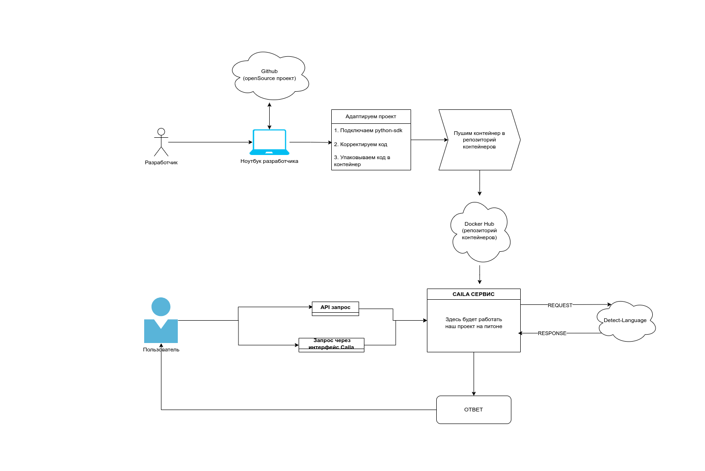
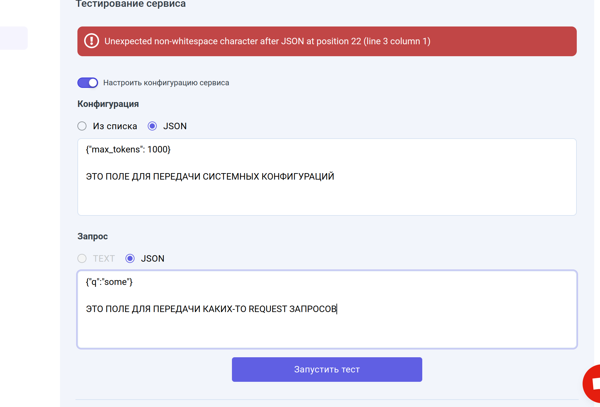
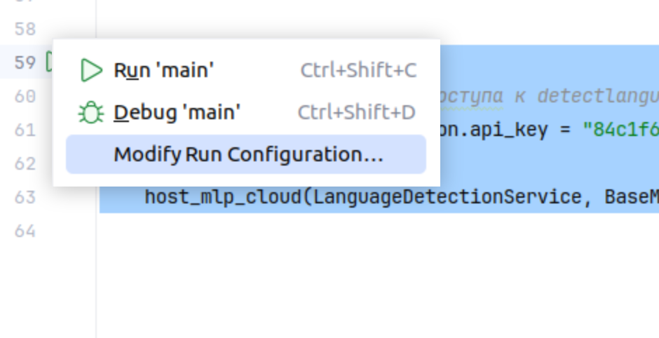
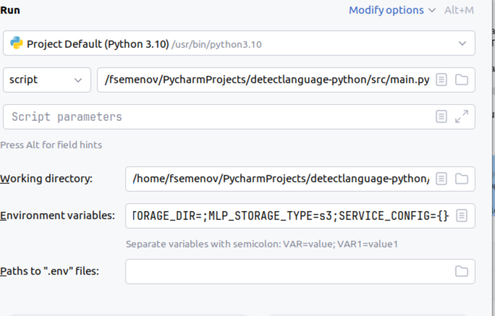
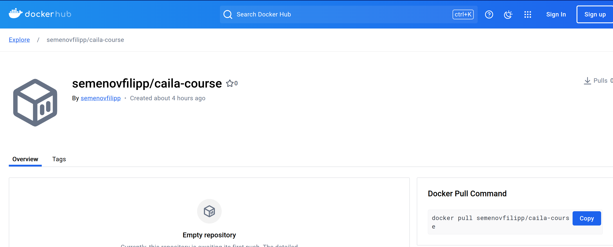
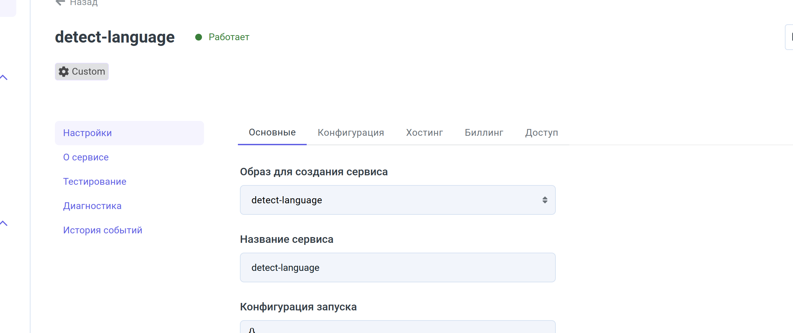

Сервис по детекции языка
========

### Описание
Сервис для определения языка текста с использованием библиотеки detectlanguage.
Проект использует API для отправления запросов в detectlanguage.com и получения ответа.

Пример запроса по API detectionlanguage.com:
```
detectlanguage.detect("Привет, как дела")
```

Привет ответа по API от detectionlanguage.com:
```commandline
[{'isReliable': True, 'confidence': 12.04, 'language': 'ru'}]
```

### Порядок работы нашего проекта
1. Запрос из Caila отправится в наш сервис на Python
2. Наш сервис на Python отправит запрос в detectlanguage.com
3. Наш сервис на Python получит ответ от detectlanguage.com
4. Наш сервис на Python отправит ответ в Caila




## Пререквесты
1. Linux|MacOS|Windows(WSL)
2. Среда разработки (PyCharm|VSCode)
3. Docker
4. Аккаунт в Docker Hub
5. Аккаунт в caila.io


Перед использованием клиента API для определения языка необходимо настроить личный ключ API.
Вы можете получить его, зарегистрировавшись на https://detectlanguage.com

Ключ нужно вставить по пути src/main.py в этом куске кода (Указано в пункте разделе "Локальный запуск кода")

```python
if __name__ == "__main__":
    # Устанавливаем ключ для доступа к detectlanguage
    detectlanguage.configuration.api_key = "какой-то ключ"
    # Запускаем сервис
    host_mlp_cloud(LanguageDetectionService, BaseModel())

```
_____
### Пример использования
1. JSON файл который мы отправляем из Caila.io в наш сервис на Python

```JSOn
{"query":"Привет"}
```

2. JSON файл который мы получаем из нашего сервиса на Python

```commandline
{
  "detections": [
    {
      "language": "en",
      "isReliable": true,
      "confidence": 3.84
    },
    {
      "language": "pt",
      "isReliable": false,
      "confidence": 3.84
    },
    {
      "language": "it",
      "isReliable": false,
      "confidence": 3.84
    }
  ]
}
```
____
## Запуск кода на Windows через WSL

1. Заходим в WSL

2. Переходим в целевую папку, копируем туда репозиторий проекта detect-language

```commandline
https://github.com/detectlanguage/detectlanguage-python
```
```

3. Проверяем питон:

```
python3 --version
```

4. Если версия 3.11 и выше, нужно поставить версию 3.10:
```commandline
sudo apt update
   sudo apt install software-properties-common
   sudo add-apt-repository ppa:deadsnakes/ppa
   sudo apt update
   sudo apt install python3.10
```
   
(примечание: команда sudo позволяет вызывать команды от лица администратора, при первом вызове sudo система попросит ввести пароль от ubuntu (создавался на шаге wsl --install -d Ubuntu))

5. Ставим версию 3.10 версией по дефолту
```commandline
   sudo update-alternatives --install /usr/bin/python3 python3 /usr/bin/python3.10 1
```


6. Устанавливаем pip для установки зависимостей
```commandline
   sudo apt install python3-pip
```

7. Если apt не работает:
```commandline
 sudo apt install --reinstall python3-apt
   sudo apt install --reinstall apt
   sudo apt update

``` 
8. Устанавливаем distutils и setuptools (если они не скачиваются из requirements.txt)

```commandline
 sudo apt install python3.10 python3.10-venv python3.10-distutils
   python3 -m pip install --upgrade setuptools

```
  
9. Создаем виртуальное окружение
```
python3.10 -m venv myenv
```
   

10. Активируем виртуальное окружение
```
source myenv/bin/activate
```
    

11. Устанавливаем зависимости
```commandline
pip install --no-cache-dir -r requirements.txt
```
    

12. Запускаем программу (одной командой):
Указанные env перменные нужно будет заменить на свои
```
MLP_ACCOUNT_ID=1000147788 \
    MLP_MODEL_ID=99013 \
    MLP_INSTANCE_ID=35928 \
    MLP_MODEL_NAME=caila-course \
    HOSTNAME=$(hostname) \
    MLP_SERVICE_TOKEN=1000147788.99013.lnasdlnkasdkjasdkasadkjasnadk \
    MLP_REST_URL=https://caila.io \
    MLP_GRPC_HOST=gate.caila.io:443 \
    MLP_GRPC_HOSTS=0.gate.caila.io:443,1.gate.caila.io:443,2.gate.caila.io:443,3.gate.caila.io:443,4.gate.caila.io:443,5.gate.caila.io:443,6.gate.caila.io:443,7.gate.caila.io:443,8.gate.caila.io:443,9.gate.caila.io:443 \
    MLP_GRPC_SECURE=true \
    SERVICE_CONFIG={} \
    MLP_STORAGE_TYPE=s3 \
    MLP_S3_ENDPOINT=https://storage.caila.io \
    MLP_S3_BUCKET=s3-bucket-1000147788-kasdnasdndas \
    MLP_S3_ACCESS_KEY=s3-user-1000147788 \
    MLP_S3_SECRET_KEY=kasdjadsndasndasn \
    MLP_STORAGE_DIR= \
    python3 src/main.py
```
    
______
## Создание сервиса в Caila.io
1. Переходим в "Сервисы"
2. "Создать сервис" (называем наш сервис в графе Название сервиса) 
3. Там где "Образ для создания сервиса" мы пока ставим первый попавшийся образ.
Чуть позже когда мы соберем проект, то там поставим образ нашего проекта, который будет запущен на серверах Caila
4. Нажимаем кнопку "Создать"
5. Переходим только что созданный нами сервис
6. Переходим в графу "Хостинг"
7. "Активировать отладочное подключение"
8. Нажимаем на кнопку "env-переменные"
Это переменные нашего сервис в Caila. В этих переменных будет указан наш аккаунт и прочие тех. детали.
Они нам нужны для того что бы связать Caila с нашим проектом по сети.

### Пример env-переменных
```
MLP_ACCOUNT_ID=1000147788
MLP_MODEL_ID=94602
MLP_INSTANCE_ID=35369
MLP_MODEL_NAME=detect-language
HOSTNAME=$(hostname)
MLP_SERVICE_TOKEN=1000147788.94602.IfasdasdasdqwesaddqweXeiv
MLP_REST_URL=https://caila.io
MLP_GRPC_HOST=gate.caila.io:443
MLP_GRPC_HOSTS=0.gate.caila.io:443,1.gate.caila.io:443,2.gate.caila.io:443,3.gate.caila.io:443,4.gate.caila.io:443,5.gate.caila.io:443,6.gate.caila.io:443,7.gate.caila.io:443,8.gate.caila.io:443,9.gate.caila.io:443
MLP_GRPC_SECURE=true
SERVICE_CONFIG={}
MLP_STORAGE_TYPE=s3
MLP_S3_ENDPOINT=https://storage.caila.io
MLP_S3_BUCKET=s3-bucket-1000147788-4pasdasdasdd
MLP_S3_ACCESS_KEY=s3-user-1000147788
MLP_S3_SECRET_KEY=2lpqasdasdhzza6f
MLP_STORAGE_DIR=
```
 
9. Переходим в IDE

## Написание сервиса на Python
0. Скачиваем open-source проект с github (Пример на PyCharm)


Открываем PyCharm -> File -> Project from Version Control

И туда вставляем наш проект
```commandline
https://github.com/detectlanguage/detectlanguage-python
```

1. Добавляем зависимость на sdk в requirements.txt

```commandline
git+https://github.com/just-ai/mlp-python-sdk.git@release
```
____
2. Создаем файл main.py и добавляем в него следующий код

```commandline
class LanguageDetectionService(Task):
```
Это наш класс, который будет реализовывать логику работы с detect-language-api.
Данный класc наследует Task из библиотеки mlp-python-sdk.
Класс Task необходим для того что бы дать нам методы, которые соединят наш код на питоне с платформой Caila.io.
_____
3. Нам нужно явно инициализировать конструктор класса LanguageDetectionService, тк мы наследуемся от класса Task.
Делаем мы это при помощи конструкции super(), чтобы инициализировать атрибуты, необходимые родительскому классу Task.

```
def __init__(self, config: BaseModel, service_sdk: MlpServiceSDK = None):
        super().__init__(config, service_sdk)
```

____
4. Среда разработки обязует нас имплеминтировать метод predict, тк мы наследуемся от класса Task.

Метод predict является точкой в которую придут данные из платформы Caila.io
Соответсвенно этот метод должен будет также что-то вернуть в Caila.io

```
def predict(self, data: BaseModel, config: BaseModel) -> BaseModel:
        pass
```

Здесь в качестве аргументов мы принимаем два объекта BaseModel, которые содержат в себе данные.
Эти данные мы передаем из платформы Caila.io
-  data = какая-то информация в виде request запроса
- config = тоже какие-то данные, которые мы можем передать из платформы Caila.io. Обычно конфги



_____
5. В методе  predict ожидается, что данные, которые будут переданы в этот метод, будут экземплярами классов, наследующих от BaseModel.
```
predict(self, data: BaseModel, config: BaseModel) -> BaseModel
```

То есть перед тем как отправить наш JSON из Caila, мы должны создать под JSON класс, который будет делать сериализацию из JSON в код python.

- Это класс который будет делать сериализацию запроса из Caila
```commandline
#Наследуем от BaseModel

class PredictRequest(BaseModel):
    query: str
```

- Это класс который будет делать сериализацию ответа который полетит в Caila
```commandline
#Наследуем от BaseModel

class PredictResponse(BaseModel):
    detections: list[LanguageDetection]

class LanguageDetection(BaseModel):
    language: str
    isReliable: bool
    confidence: float
```

В итоге получится такая конструкция

```commandline
def predict(self, data: PredictRequest, config: BaseModel) -> PredictResponse:
```
 
Мы можем заменить BaseModel на свои классы, потому что наши классы являются потомками  BaseModel.
______
6. Далее мы делаем запрос в detect-language-api

```
def predict(self, data: PredictRequest, config: BaseModel) -> PredictResponse:
        raw_detections = detectlanguage.detect(data.query)
```
... и получаем от него сырой ответ

```commandline
[{'language': 'en', 'isReliable': True, 'confidence': 3.84}, {'language': 'pt', 'isReliable': False, 'confidence': 3.84}, {'language': 'it', 'isReliable': False, 'confidence': 3.84}]
```
______
7. Теперь нам этот сырой ответ нужно переложить в наш класс, который отправиться в Caila

```commandline
def predict(self, data: PredictRequest, config: BaseModel) -> PredictResponse:
        raw_detections = detectlanguage.detect(data.query)
        
        # здесь мы запихиваем каждый массив в LanguageDetection
        detections = [LanguageDetection(**detection) for detection in raw_detections]
```
_____
8. И мы просто отправляем ответ в Caila 
```
def predict(self, data: PredictRequest, config: BaseModel) -> PredictResponse:
        raw_detections = detectlanguage.detect(data.query)

        detections = [LanguageDetection(**detection) for detection in raw_detections]

        return PredictResponse(detections=detections)
```
____
## Локальный запуск кода

В том же файле main.py делаем точку старта нашего приложения

```commandline
if __name__ == "__main__":
    # Устанавливаем ключ для доступа к detectlanguage
    detectlanguage.configuration.api_key = "ВСТАВЛЯЕМ СВОЙ КЛЮЧ"
    # Запускаем сервис
    host_mlp_cloud(LanguageDetectionService, BaseModel())
```

При запуске нажимаем на кнопку "Run" -> "Modify run configuration"


Далее там где "Environment variables" мы вставляем env-переменные, которые получили из Caila


После этого "Apply" -> "Run"
_____

## Тестирование
1. Переходим в наш сервис в Caila
2. Тестирование
3. И в графе JSON вствляем наш запрос

```JSOn
{"query":"Привет"}
```
4. Получаем наш ответ
```commandline
{
  "detections": [
    {
      "language": "ru",
      "isReliable": true,
      "confidence": 5.94
    },
    {
      "language": "bg",
      "isReliable": false,
      "confidence": 5.94
    }
  ]
}
```
------
## Создание Dockerfile
Для того что бы наш код можно было запускать на другом компьютере с меньшими зависимостями, существует Docker. 

1. Создаем Dockerfile
2. Заполняем его следующим образом
```commandline
# Версия питона которая будет использоваться для запуска нашего кода
FROM python:3.10


# Устанавливаем рабочую директорию
WORKDIR /app

# Устанавливаем зависимости
COPY requirements.txt /app/
RUN pip install --no-cache-dir -r requirements.txt

# Копируем исходный код в контейнер
COPY src /app/src

# Запускаем приложение
CMD ["python", "/app/src/main.py"]
```

______
## Создание скрипта для пуша  контейнера в репозиторий с docker контейнерами

Создадим файл build.sh который будет делать сборку образа и последующий пуш в репозиторий контейнеров.
Это нужно для того что бы мы могли в Caila указать ссылку на репозиторий и скачать с него наш контейнер в котором проект на python.
____
Предварительно нам нужно зарегестрироваться на Docker Hub и создать свой ПУБЛИЧНЫЙ репозиторий

**Пример**

____
Копируем оттуда имя вашего репозитория
В моем случае это
```commandline
semenovfilipp/caila-course
```
_____
Далее в скрипте build.sh пишем следующее

```commandline
# Указание на использование bash как интерпретатора для выполнения этого скрипта
#!/bin/bash

# Создаем переменную ROOT для хранения директории, содержащей этот скрипт (даёт полный путь к скрипту при помощи dirname $0).
ROOT=$(dirname $0)

# Переходим в директорию, указанную в переменной ROOT
cd "$ROOT"

# Ваши переменные для логина и пароля в Docker Hub
DOCKER_USERNAME="semenovfilipp"
DOCKER_PASSWORD="asdasdasd"


# Выполнение логина на Docker Hub с использованием указанных имени пользователя и пароля
docker login -u "$DOCKER_USERNAME" -p "$DOCKER_PASSWORD"

# Печать сообщения о начале сборки проекта
echo "Building project..."

# Определение текущей ветки Git и сохранение её в переменную BUILD_BRANCH
BUILD_BRANCH=$(git rev-parse --abbrev-ref HEAD)

# Преобразование названия текущей ветки Git в нижний регистр и сохранение в переменной BRANCH_NAME_LOWER
BRANCH_NAME_LOWER=$(echo "$BUILD_BRANCH" | tr '[:upper:]' '[:lower:]')

# ЗАМЕНИТЕ НА АДРЕС ВАШЕГО РЕПОЗИТОРИЯ
# IMAGE=ваш_профиль/ваш_репо:$BRANCH_NAME_LOWER
IMAGE=semenovfilipp/caila-course:$BRANCH_NAME_LOWER

# Сборка Docker образа с использованием Docker BuildKit. Контекст сборки — текущая директория (.). 
# Переменная IMAGE_NAME передается как аргумент сборки. Тег образа (-t) указывается как значение переменной IMAGE.
DOCKER_BUILDKIT=1 docker build --build-arg IMAGE_NAME=$IMAGE . -t "$IMAGE"

# Публикация (push) созданного Docker образа на Docker Hub с тегом, определенным в переменной IMAGE.
docker push "$IMAGE"

# Вывод разделительных линий и имени Docker образа, созданного и отправленного на Docker Hub
echo --------------------------------------------------
echo Docker image: $IMAGE
echo --------------------------------------------------

```
_____
Запускаем скрипт.

После выполнения скрипта копируем ссылку на ваш docker репозиторий

**Пример**
```commandline
semenovfilipp/caila-course:dev
```
______
## Запуск сервиса на Caila

После того как мы запушили наш образ на docker hub, переходим на Caila и создаем образ.

1. Графа "Настройки" -> "Образы"
2. "Создать образ"
3. В графе "Адрес в docker-репозитории" вписываем адрес вашего образа

**Пример:**
```commandline
semenovfilipp/caila-course:dev
```
4. Идем в наш сервис во вкладке "Сервисы"
5. Внутри нашего сервиса нажимаем "Настройки" и выбираем кнопку для редактирования
6. В графе "Образ для создания сервиса" указываем наш образ

7. Далее здесь же в "Хостинг" -> "Управление инстансами" и нажимаем +
Этим мы запускаем на выделенном сервере наш docker образ который скачается с docker репозитория.


Напротив названия нашего сервиса у нас должен загорется зеленый значек что сервис "Работает".

8. Далее просто проверяем работоспособность нашего сервиса.

Переходим в тестирование -> JSON и вписываем в поле наш запрос

```commandline
{"query":"Привет"}
```
9. Получаем ответ

```commandline
{
  "detections": [
    {
      "language": "ru",
      "isReliable": true,
      "confidence": 5.94
    },
    {
      "language": "bg",
      "isReliable": false,
      "confidence": 5.94
    }
  ]
}
```
______
## Использование Caila по API

В наш сервис мы можем отправить запрос через API, для этого нам нужно получить ключ API.
Ключ можно получить в графе "API-Токены" на главной странице caila.io

**Пример**:
```commandline
1000147788.114664.DV2K6DL2VIFWbrcRVQoGvNGiopIuoY0Hjo0pMSqt
```
_____
Далее мы можем послать запрос по типу:

`https://caila.io/api/mlpgate/account/<id_вашего_аккаунта>/model/<id_вашего_сервиса>/predict`

**Пример запроса:**
```commandline
curl -X POST https://caila.io/api/mlpgate/account/1000147788/model/94602/predict \
    -H "MLP-API-KEY: 1000147788.114664.DV2K6DL2VIFWbrcRVQoGvNGiopIuoY0Hjo0pMSqt" \
    -H "Content-Type: application/json" \
    -d '{"query":"Привет"}'
```
____
Вы можете взять из URL вашего сервиса
- id_вашего_аккаунта
- id_вашего_сервиса


```https://caila.io/workspace/model/<id_account>/id_service/settings/about-service```

_____
**Ответ:**
```commandline
{"detections": [{"language": "ru", "isReliable": true, "confidence": 5.94}, {"language": "bg", "isReliable": false, "confidence": 5.94}]}
```