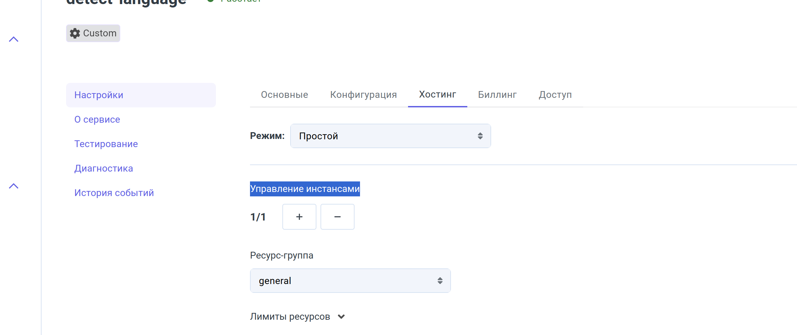

# API Клиент Определения Языка

Сервис по определению языка на основе текста

## Пререквизиты

Перед использованием клиента API для определения языка необходимо настроить личный ключ API. Вы можете получить его, зарегистрировавшись на https://detectlanguage.com.

Ключ нужно вставить по пути src/main.py в этом куске кода (указано в разделе "Локальный запуск кода").

```python
if __name__ == "__main__":
    # Устанавливаем ключ для доступа к detectlanguage
    detectlanguage.configuration.api_key = "какой-то ключ"
    # Запускаем сервис
    host_mlp_cloud(LanguageDetectionService, BaseModel())
```

### Пример использования

1. JSON файл, который мы отправляем из Caila.io в наш сервис на Python:

```json
{"query":"Привет"}
```

2. JSON файл, который мы получаем из нашего сервиса на Python:

```json
{
  "detections": [
    {
      "language": "en",
      "isReliable": true,
      "confidence": 3.84
    },
    {
      "language": "pt",
      "isReliable": false,
      "confidence": 3.84
    },
    {
      "language": "it",
      "isReliable": false,
      "confidence": 3.84
    }
  ]
}
```

## Создание сервиса в Caila.io

1. Переходим в "Сервисы".
2. "Создать сервис" (называем наш сервис в графе Название сервиса).
3. Там, где "Образ для создания сервиса", мы пока ставим первый попавшийся образ. Чуть позже, когда мы соберем проект, то там поставим образ нашего проекта, который будет запущен на серверах Caila.
4. Нажимаем кнопку "Создать".
5. Переходим в только что созданный нами сервис.
6. Переходим в графу "Хостинг".
7. "Активировать отладочное подключение".
8. Нажимаем на кнопку "env-переменные". Это переменные нашего сервиса в Caila. В этих переменных будет указан наш аккаунт и прочие тех. детали. Они нам нужны для того чтобы связать Caila с нашим проектом по сети.

### Пример env-переменных

```
MLP_ACCOUNT_ID=1000147788
MLP_MODEL_ID=94602
MLP_INSTANCE_ID=35369
MLP_MODEL_NAME=detect-language
HOSTNAME=$(hostname)
MLP_SERVICE_TOKEN=1000147788.94602.Ifd0VEG5khQevl3ZMEyU14oEtkvOhabw1GIpXeiv
MLP_REST_URL=https://caila.io
MLP_GRPC_HOST=gate.caila.io:443
MLP_GRPC_HOSTS=0.gate.caila.io:443,1.gate.caila.io:443,2.gate.caila.io:443,3.gate.caila.io:443,4.gate.caila.io:443,5.gate.caila.io:443,6.gate.caila.io:443,7.gate.caila.io:443,8.gate.caila.io:443,9.gate.caila.io:443
MLP_GRPC_SECURE=true
SERVICE_CONFIG={}
MLP_STORAGE_TYPE=s3
MLP_S3_ENDPOINT=https://storage.caila.io
MLP_S3_BUCKET=s3-bucket-1000147788-4pkgynndrs
MLP_S3_ACCESS_KEY=s3-user-1000147788
MLP_S3_SECRET_KEY=2lpqqi3gluwe5ahzza6f
MLP_STORAGE_DIR=
```

9. Переходим в IDE.

## Написание сервиса на Python

0. Скачиваем open-source проект с GitHub (пример на PyCharm).

Открываем PyCharm -> File -> Project from Version Control

И туда вставляем наш проект:
```commandline
https://github.com/detectlanguage/detectlanguage-python
```

1. Добавляем зависимость на SDK в requirements.txt:

```commandline
git+https://github.com/just-ai/mlp-python-sdk.git@release
```

2. Создаем файл main.py и добавляем в него следующий код:

```python
class LanguageDetectionService(Task):
```

Это наш класс, который будет реализовывать логику работы с detect-language-api. Данный класс наследует Task из библиотеки mlp-python-sdk. Класс Task необходим для того, чтобы дать нам методы, которые соединят наш код на Python с платформой Caila.io.

3. Нам нужно явно инициализировать конструктор класса LanguageDetectionService, т.к. мы наследуемся от класса Task. Делаем мы это при помощи конструкции super(), чтобы инициализировать атрибуты, необходимые родительскому классу Task.

```python
def __init__(self, config: BaseModel, service_sdk: MlpServiceSDK = None):
    super().__init__(config, service_sdk)
```

4. Среда разработки обязует нас имплементировать метод predict, т.к. мы наследуемся от класса Task. Метод predict является точкой, в которую придут данные из платформы Caila.io. Соответственно, этот метод должен будет что-то вернуть в Caila.io.

```python
def predict(self, data: BaseModel, config: BaseModel) -> BaseModel:
    pass
```

Здесь в качестве аргументов мы принимаем два объекта BaseModel, которые содержат в себе данные. Эти данные мы передаем из платформы Caila.io:
- data = какая-то информация в виде запроса
- config = конфигурационные данные из платформы Caila.io

5. В методе predict ожидается, что данные, которые будут переданы в этот метод, будут экземплярами классов, наследующих от BaseModel.

```python
predict(self, data: BaseModel, config: BaseModel) -> BaseModel
```

Перед тем как отправить наш JSON из Caila, мы должны создать под JSON класс, который будет делать сериализацию из JSON в код на Python.

- Класс для сериализации запроса из Caila:

```python
class PredictRequest(BaseModel):
    query: str
```

- Класс для сериализации ответа, который отправится в Caila:

```python
class PredictResponse(BaseModel):
    detections: list[LanguageDetection]

class LanguageDetection(BaseModel):
    language: str
    isReliable: bool
    confidence: float
```

В итоге получится такая конструкция:

```python
def predict(self, data: PredictRequest, config: BaseModel) -> PredictResponse:
```

Мы можем заменить BaseModel на свои классы, потому что наши классы являются потомками BaseModel.

6. Далее мы делаем запрос в detect-language-api:

```python
def predict(self, data: PredictRequest, config: BaseModel) -> PredictResponse:
    raw_detections = detectlanguage.detect(data.query)
```

...и получаем от него сырой ответ:

```json
[
  {'language': 'en', 'isReliable': True, 'confidence': 3.84}, 
  {'language': 'pt', 'isReliable': False, 'confidence': 3.84}, 
  {'language': 'it', 'isReliable': False, 'confidence': 3.84}
]
```

7. Теперь нам этот сырой ответ нужно переложить в наш класс, который отправится в Caila:

```python
def predict(self, data: PredictRequest, config: BaseModel) -> PredictResponse:
    raw_detections = detectlanguage.detect(data.query)
    
    detections = [LanguageDetection(**detection) for detection in raw_detections]
```

8. И мы просто отправляем ответ в Caila:

```python
def predict(self, data: PredictRequest, config: BaseModel) -> PredictResponse:
    raw_detections = detectlanguage.detect(data.query)

    detections = [LanguageDetection(**detection) for detection in raw_detections]

    return PredictResponse(detections=detections)
```

## Локальный запуск кода

В том же файле main.py делаем точку старта нашего приложения:

```python
if __name__ == "__main__":
    # Устанавливаем ключ для доступа к detectlanguage
    detectlanguage.configuration.api_key = "ВСТАВЛЯЕМ СВОЙ КЛЮЧ"
    # Запускаем сервис
    host_mlp_cloud(LanguageDetectionService, BaseModel())
```

При запуске нажимаем на кнопку "Run" -> "Modify run configuration":


Далее там, где "Environment variables", вставляем env-переменные, которые получили из Caila:


После этого "Apply" -> "Run".

## Тестирование

1. Переходим в наш сервис в Caila.
2. Переходим в "Тестирование".
3. В графе JSON вставляем наш запрос:

```json
{"query":"Привет"}
```

4. Получаем наш ответ:

```json
{
  "detections": [
    {
      "language": "ru",
      "isReliable": true,
      "confidence": 5.94
    },
    {
      "language": "bg",
      "isReliable": false,
      "confidence": 5.94
    }
  ]
}
```

## Создание Dockerfile

Для того чтобы наш код можно было запускать на другом компьютере с меньшими зависимостями, существует Docker.

1. Создаем Dockerfile.
2. Заполняем его следующим образом:

```dockerfile
# Версия Python, которая будет использоваться для запуска нашего кода
FROM python:3.10

# Устанавливаем рабочую директорию
WORKDIR /app

# Устанавливаем зависимости
COPY requirements.txt /app/
RUN pip install --no-cache-dir -r requirements.txt

# Копируем исходный код в контейнер
COPY src /app/src

# Запускаем приложение
CMD ["python", "/app/src/main.py"]
```

## Создание скрипта для пуша контейнера в репозиторий с Docker контейнерами

Создадим файл build.sh, который будет делать сборку образа и последующий пуш в репозиторий контейнеров.
Это нужно для того, чтобы мы могли в Caila указать ссылку на репозиторий и скачать с него наш контейнер, в котором проект на Python.

Предварительно нам нужно зарегистрироваться на Docker Hub и создать свой публичный репозиторий.

### Пример


Копируем оттуда имя вашего репозитория. В моем случае это:

```commandline
semenovfilipp/caila-course
```

Далее в скрипте build.sh пишем следующее:

```bash
#!/bin/bash

# Создаем переменную ROOT для хранения директории, содержащей этот скрипт (дает полный путь к скрипту при помощи dirname $0).
ROOT=$(dirname $0)

# Переходим в директорию, указанную в переменной ROOT
cd "$ROOT"

# Ваши переменные для логина и пароля в Docker Hub
DOCKER_USERNAME="semenовfilipp"
DOCKER_PASSWORD="asdasdasd"

# Выполнение логина на Docker Hub с использованием указанных имени пользователя и пароля
docker login -u "$DOCKER_USERNAME" -p "$DOCKER_PASSWORD"

# Печать сообщения о начале сборки проекта
echo "Building project..."

# Определение текущей ветки Git и сохранение ее в переменную BUILD_BRANCH
BUILD_BRANCH=$(git rev-parse --abbrev-ref HEAD)

# Преобразование названия текущей ветки Git в нижний регистр и сохранение в переменной BRANCH_NAME_LOWER
BRANCH_NAME_LOWER=$(echo "$BUILD_BRANCH" | tr '[:upper:]' '[:lower:]')

# ЗАМЕНИТЕ НА АДРЕС ВАШЕГО РЕПОЗИТОРИЯ
# IMAGE=ваш_профиль/ваш_репо:$BRANCH_NAME_LOWER
IMAGE=semenovfilipp/caila-course:$BRANCH_NAME_LOWER

# Сборка Docker образа с использованием Docker BuildKit. Контекст сборки — текущая директория (.). 
# Переменная IMAGE_NAME передается как аргумент сборки. Тег образа (-t) указывается как значение переменной IMAGE.
DOCKER_BUILDKIT=1 docker build --build-arg IMAGE_NAME=$IMAGE . -t "$IMAGE"

# Публикация (push) созданного Docker образа на Docker Hub с тегом, определенным в переменной IMAGE.
docker push "$IMAGE"

# Вывод разделительных линий и имени Docker образа, созданного и отправленного на Docker Hub
echo --------------------------------------------------
echo Docker image: $IMAGE
echo --------------------------------------------------
```

Запускаем скрипт.

После выполнения скрипта копируем ссылку на ваш Docker репозиторий. В моем случае это:
```commandline
semenovfilipp/caila-course:dev
```

## Запуск сервиса на Caila

После того как мы запушили наш образ на Docker Hub, переходим на Caila и создаем образ.

1. Переходим в графу "Настройки" -> "Образы".
2. Нажимаем "Создать образ".
3. В графе "Адрес в Docker-репозитории" вписываем адрес вашего образа. Пример:

```commandline
semenovfilipp/caila-course:dev
```

4. Идем в наш сервис во вкладке "Сервисы".
5. Внутри нашего сервиса нажимаем "Настройки" и выбираем кнопку для редактирования.
6. В графе "Образ для создания сервиса" указываем наш образ:


7. Переходим в "Хостинг" -> "Управление инстансами" и нажимаем +. Этим мы запускаем на выделенном сервере наш Docker образ, который скачается из репозитория:



Напротив названия нашего сервиса у нас должен загореться зеленый значок, что сервис "Работает".

8. Далее проверяем работоспособность нашего сервиса. Переходим в "Тестирование" -> JSON и вписываем в поле наш запрос:

```json
{"query":"Привет"}
```

9. Получаем ответ:

```json
{
  "detections": [
    {
      "language": "ru",
      "isReliable": true,
      "confidence": 5.94
    },
    {
      "language": "bg",
      "isReliable": false,
      "confidence": 5.94
    }
  ]
}
```